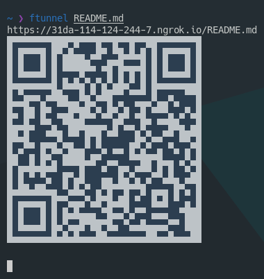

# File Tunnel

[](https://npmjs.org/package/ftunnel)

A CLI program to temporary host a file in internet via ngrok tunnel. Share link via barcode or copy the hyperlink from your terminal.

### Usage:

Since version `0.2.0` you are now required to set your [ngrok token](https://dashboard.ngrok.com/get-started/your-authtoken) as `NGROK_AUTHTOKEN` environment variable.

Run the program:

```sh
npx ftunnel <file-name-in-current-dir>
```



### Development

Install the required dependencies:

```sh
npm install
```

Link binary to your path:

```sh
npm link
```

## License 

File Tunnel made using these dependencies:
- `ngrok`, licensed under BSD-2-Clause 
- `qrcode`, licensed under MIT
